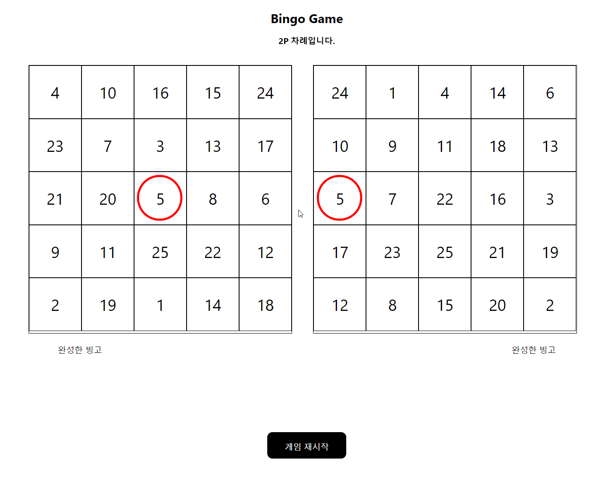

# BingoGame 

## 배포 

https://cocky-dijkstra-ba9cec.netlify.com

## Introduction

Rebux와 React를 이용해 빙고 게임을 구현하였습니다. 하나의 Store를 만들어 상태 관리를 하였으며, 리듀서 함수가 액션 객체를 파라미터로 이용해 새로운 상태를 반환하도록 했습니다. 리듀서 함수는 순수함수로서 동일한 값에는 동일한 결과를 반환하도록 하였습니다. 컴포넌트는 상태 변화에 따라 Vitual DOM과 DOM 차이가 생기는 부분을 기준으로 나뉘었습니다. 그래서 최소한 랜더링을 하도록 설계하였습니다. 

## Requirements

- 1024px 이상의 큰 브라우저 환경에서 실행해야 합니다.

## Installation

<pre>
git clone https://github.com/wooder2050/bingo-game.git
cd bingo-game
yarn install
yarn start
</pre>

## Test

- Component Unit Test (Jest, Enzyme)

## 아쉬운점

- 이번 과제에선 css 전처기를 사용하지 못하고 간단한 css 작업만 했습니다. 다음에는 스타일을 넣어서 게임을 더 재미있게 만들어 보고 싶습니다.
- e2e 테스트와 더 많은 테스트를 쓰지 못해서 아쉬웠습니다. 테스트 기반으로 프로젝트를 해보고 싶습니다. 

## Thanks
- 온라인 과제를 할 수 있어서 큰 행운이라고 생각합니다. 기회를 주셔서 감사합니다.  

